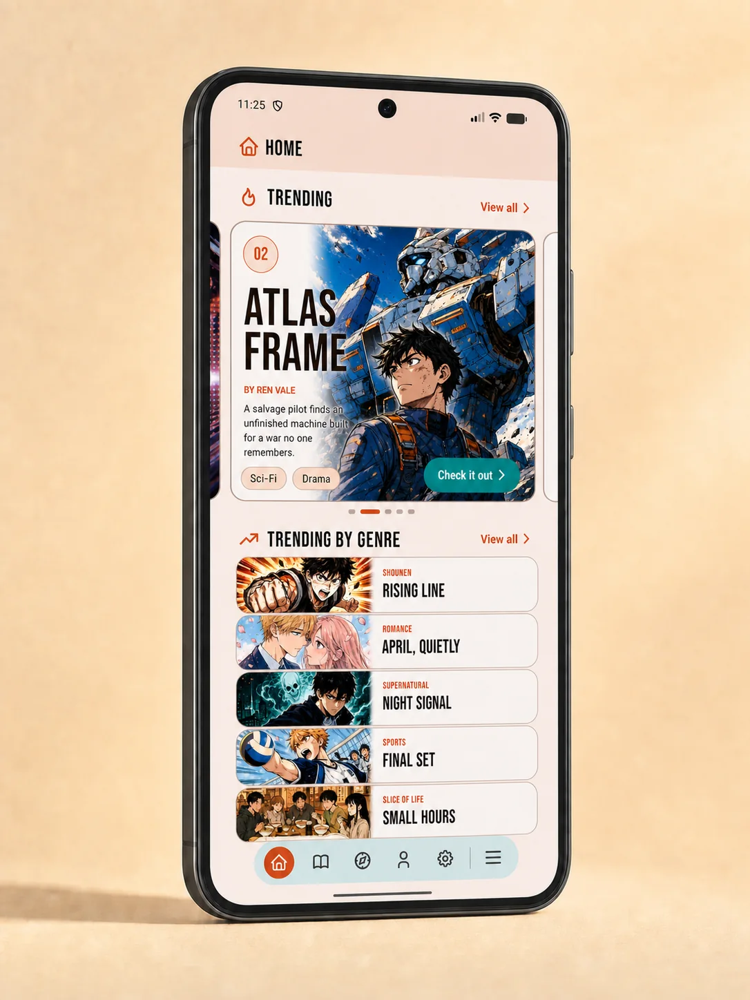
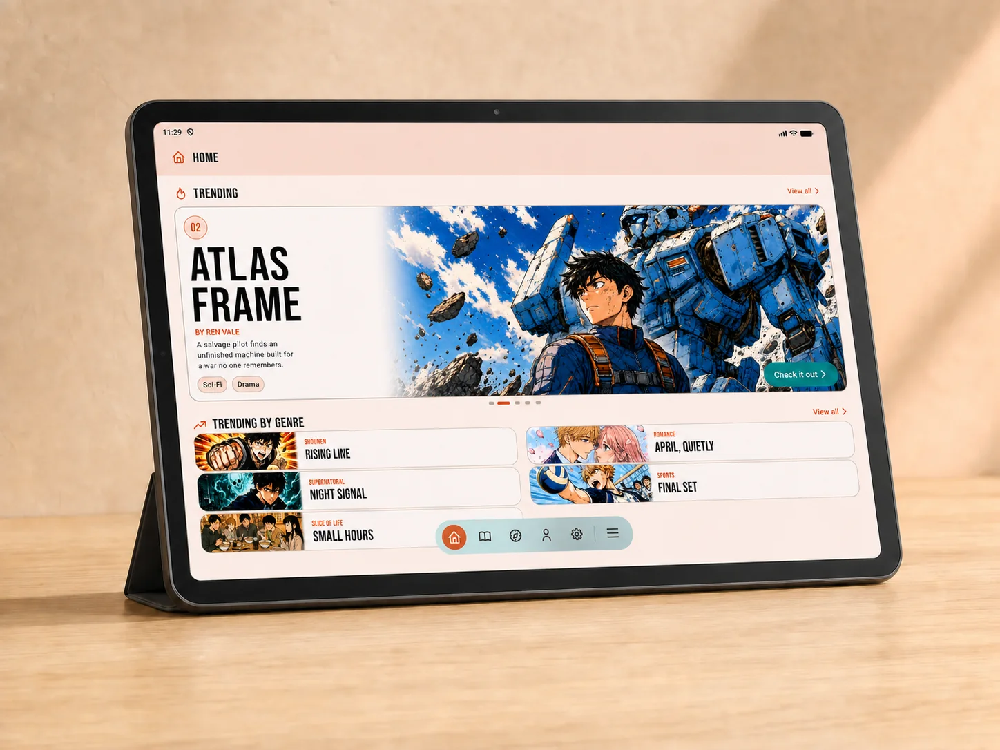
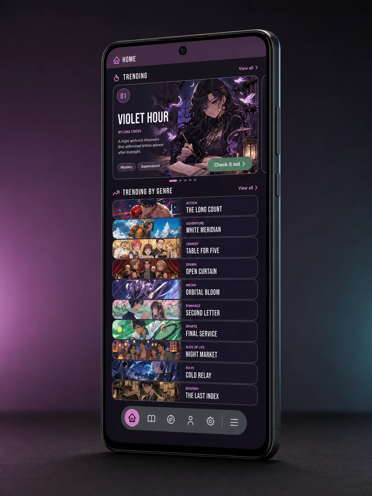
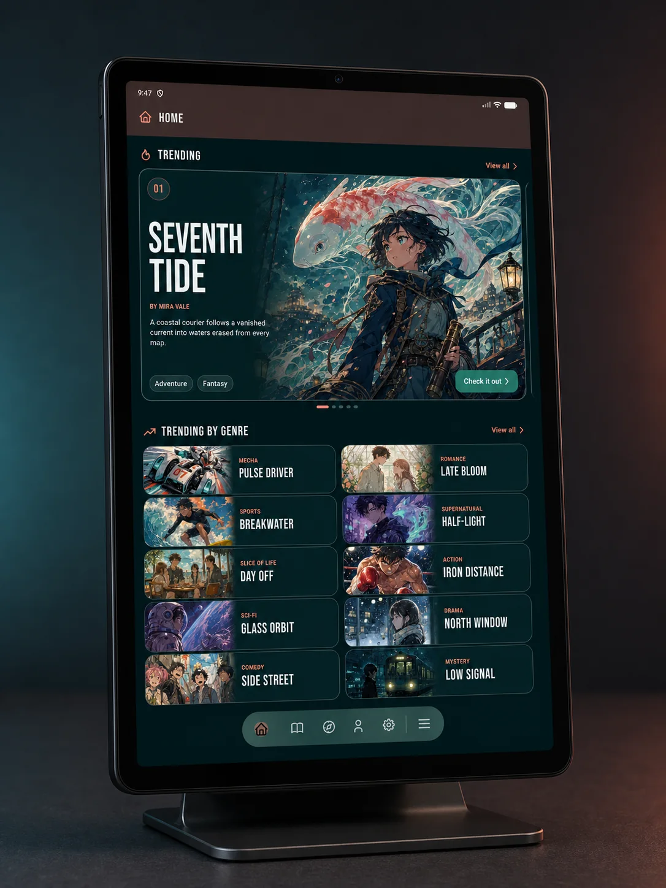
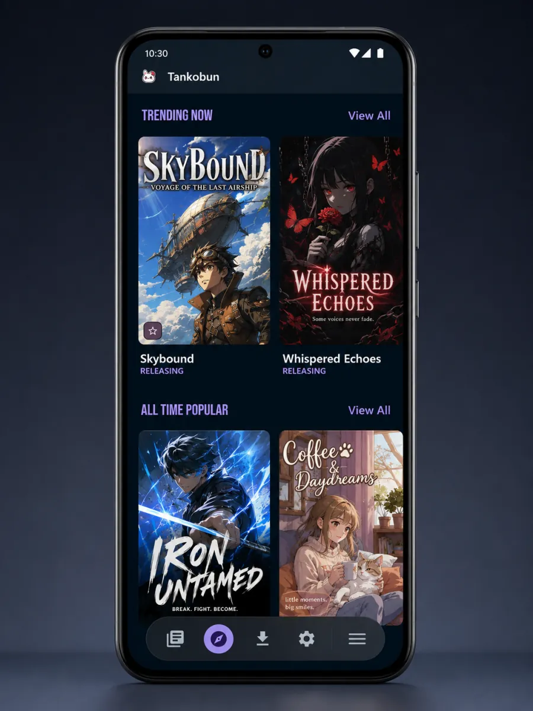
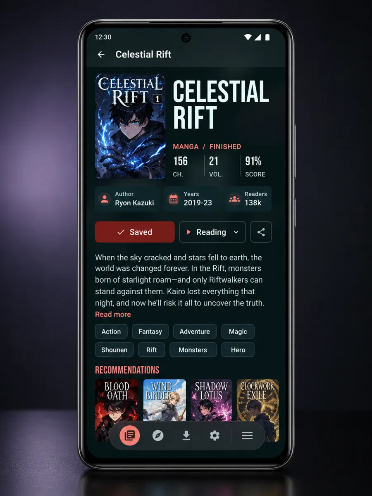

<p align="center">
  
</p>

<h1 align="center">Tankobun</h1>

<p align="center">
  <strong>A personal Android manga shelf for reading, tracking, and AniList-compatible organization.</strong>
</p>

<p align="center">
  Tankobun helps you keep a local or AniList-synced manga library, reading progress, sources, downloads, and backups in one beautiful app.
</p>

<p align="center">
  
  
</p>

<p align="center">
  
  
</p>

<p align="center">
  
  
  
</p>

<p align="center">
  <sub>All titles, characters, covers, and artwork shown in these previews are fictional material created for this project.</sub>
</p>

## What Tankobun Is

Tankobun is an Android reader and tracking client built around an AniList-compatible workflow, with an adaptive Home dashboard, responsive phone/tablet layouts, and a customizable visual system.

It is designed as a personal reading shelf: use a local library or sign in with AniList, browse manga metadata, open a manga entry, choose a user-installed source when available, read in paged or webtoon mode, and keep your progress organized.

Local library mode does not require an AniList account. Local entries are still matched to AniList manga metadata and use AniList-compatible statuses, scoring, notes, progress, and custom lists so a user can connect AniList later with cleaner sync/merge behavior.

Tankobun is not a content service, content host, extension repository, or manga source.

## What Tankobun Does

- Local manga library mode with AniList-matched entries.
- AniList login and user-authorized library sync.
- Adaptive Home with AniList metadata highlights, Continue Reading, and genre discovery.
- Profile dashboard with reading activity, library statistics, genre insights, and achievements.
- Fourteen color palettes with independent Defined or Rounded component shapes.
- Manga list browsing, status management, scoring, custom lists, and progress updates.
- Reader interface with paged and webtoon modes.
- Local reading state, caching, and optional offline storage for user-selected sources where permitted by the source and applicable law.
- Source selection through extensions installed by the user.
- Native Tankobun JSON backup export for local libraries.
- MyAnimeList-compatible XML backup export for AniList-mode lists.
- In-app restore tools for supported backup files.
- Library batch selection for sharing recommendations, changing status, editing custom lists, and removing manga.
- `.tankobun-recs` recommendation files for sharing selected manga metadata with friends, with import preview and optional import into a named custom list.

## Sources, Extensions, and Content

Tankobun does not host, upload, index, provide, sell, bundle, or distribute manga, chapters, scanlations, extensions, source APKs, or extension repository URLs.

Tankobun does not include a default extension repository. It does not recommend source repositories, source websites, or places to obtain manga content.

Any source extension used with Tankobun must be added and installed by the user. The user is solely responsible for choosing which extensions, repositories, websites, or services they use, and for making sure their use complies with applicable laws, site terms, publisher rights, and creator rights.

Before loading an installed extension, Tankobun asks the user to trust its package and current signing identity. Existing extensions also need this initial approval; updates signed by the same identity retain it. A changed signer requires a new review. Extensions execute inside Tankobun's process: this approval is not a sandbox or a guarantee that an extension is safe.

Tankobun is only a reader/tracking client. It does not grant permission to access, copy, download, or redistribute any third-party content.

Recommendation sharing files contain manga metadata and recommendation list names only. They do not include manga content, chapter URLs, source links, downloaded files, source repositories, source APKs, notes, scores, private flags, or tokens.

Personal library/settings backups are different from recommendation files: they can preserve source bindings and repository addresses configured by the user. They are intended for personal restoration and do not add built-in source recommendations.

Import reads are limited to 4 MiB for recommendation files and 32 MiB for backups. Cancelled recommendation previews do not persist file-provided metadata. Deferred AniList mutations are bound to their original login session; legacy or different-session rows are retained locally and are not automatically submitted with another login. Cross-account transfer remains an explicit library merge action.

## APK Releases

APK files, when published in this repository, are provided only as convenience builds of this project's source code.

The APK does not include manga content, source extensions, source repositories, or content feeds. Installing the APK does not provide access to any manga source by itself.

Tankobun is not distributed through Google Play. Android may show warnings when installing APKs from outside an app store. Install only if you understand and accept the risks of sideloading Android applications.

## App Updates

Tankobun can check for app updates from a static `updates.json` manifest hosted by this project, for example with GitHub Pages, with APK assets published through GitHub Releases.

The update manifest is only for official Tankobun app APK builds. It must not include manga content, source extensions, extension repository URLs, source recommendations, content feeds, or bypass/access guidance.

Release APK updates must keep the same application id and signing lineage as the installed build, and each new release must use a higher `versionCode`.

For release builds, set `tankobunUpdateManifestUrl` in `local.properties` or `TANKOBUN_UPDATE_MANIFEST_URL` in the environment. The default points to:

```text
https://johankrs.github.io/Tankobun/updates.json
```

The app checks this manifest quietly at most once per day and also offers a manual check in Settings > About. Android still asks the user to confirm installation of downloaded APK updates.

The published manifest for official builds is stored as `docs/updates.json` and is served by GitHub Pages at the URL above.

## Support Policy

Bug reports and feature requests about the app itself are welcome.

Please do not open issues, discussions, pull requests, or support requests asking for:

- Extension repository URLs.
- Recommendations for manga sources.
- Help accessing specific manga websites.
- Help bypassing paywalls, subscriptions, login requirements, DRM, region restrictions, blocks, or other access controls.
- Help downloading, copying, or redistributing copyrighted content without permission.

Requests of that kind may be closed or removed without response.

## AniList

Tankobun uses AniList manga metadata for local and synced libraries. When a user chooses AniList sync, Tankobun uses the AniList API with user authorization.

AniList [describes itself](https://docs.anilist.co/guide/introduction) as an anime and manga database, tracking, and social site. AniList is not a manga host, source, or chapter provider, and it does not host, upload, share, sell, or provide manga, chapters, or scanlations.

Tankobun is not affiliated with, endorsed by, sponsored by, or officially supported by AniList. AniList names, marks, data, and services belong to AniList and their respective owners.

To enable AniList login in your own build, create your own AniList API client and use:

```text
tankobun://auth/anilist
```

as the redirect URL.

## Extension Compatibility

Tankobun can work with user-installed extensions that follow a compatible extension format used by community manga reader ecosystems.

Compatibility does not mean affiliation, endorsement, or support from those projects, their maintainers, extension authors, source websites, publishers, or content providers.

All extension code, source integrations, service names, trademarks, and third-party content remain the property of their respective owners.

## Building

1. Install Android Studio with the required Android SDK version.
2. Copy `local.properties.example` to `local.properties`.
3. Add your own AniList client id:

```properties
anilistClientId=
```

4. For signed release builds, also provide your own release keystore values in `local.properties` or the matching `TANKOBUN_RELEASE_*` environment variables shown in `local.properties.example`.
5. Build the `app` module.

## Privacy

Tankobun is intended to run as a client-side Android app.

Depending on how you use it, the app may store local app data such as reading progress, cached files, downloads, backup files, preferences, and authentication data required for AniList login.

Tankobun does not operate a server controlled by this project for manga hosting, content indexing, analytics, tracking, advertising, or user profiling.

Third-party services, websites, APIs, and user-installed extensions may have their own privacy policies and terms.

## Disclaimer

Tankobun is provided for personal and lawful use only.

The author does not host, provide, endorse, verify, or control third-party manga content, source websites, extension repositories, or user-installed extensions.

Users are responsible for how they configure and use the app.

## Name and Branding

The Tankobun name, icon, and project branding identify this project. Forks, modified builds, and redistributed APKs must not imply endorsement, affiliation, or official support from the original author.

If you distribute a modified version, please use a clearly different app name, package name, and icon.

## License

This project is licensed under the MIT License. See `LICENCE.md` for details.

## Third-Party Notices

Some extension compatibility behavior is adapted from the Mihon/Tachiyomi-compatible network and extension host ecosystem under the Apache License 2.0. See `NOTICE.md` for attribution and license details.
