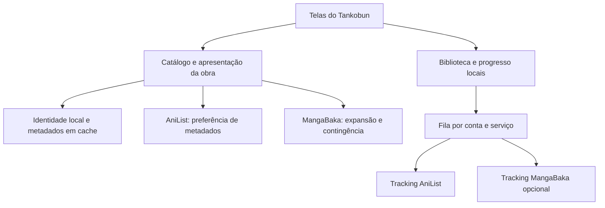

# Exploração da integração MangaBaka no Tankobun

Pesquisa de 7 de setembro de 2026. Base examinada: checkout atual, branch `mangabaka`, commit `6cec832`. A proposta considera o código atual e as APIs consultadas nesta pesquisa; a implementação da outra branch foi desconsiderada conforme solicitado. Este documento registra a pesquisa anterior à implementação; veja o estado entregue e a validação em [Integração MangaBaka](mangabaka-integration.md).

A recomendação é manter o AniList como fornecedor preferencial de metadados e apresentação, acrescentar o MangaBaka à busca e à descoberta e tornar a identidade da obra e a biblioteca independentes de ambos. Assim, o Tankobun pode continuar útil quando um serviço falha e aceitar obras que não possuem registro no AniList. A qualidade visual deve ser responsabilidade do app, com composições próprias para diferentes conjuntos de imagens disponíveis.

## Requisitos de continuidade definidos pelo usuário

A integração deve acrescentar funcionalidades ao Tankobun, preservando a experiência atual. O fluxo obrigatório permanece **pesquisar o mangá → abrir seus detalhes → encontrar/escolher a fonte → escolher o capítulo → ler e acompanhar o progresso**. Vale igualmente para obras AniList, MangaBaka e presentes nos dois catálogos.

- Manter a busca atual, as telas de detalhes e de fontes, o leitor, os temas e a organização da navegação. A busca combinada funciona por trás da interface, sem uma escolha obrigatória de banco de dados nem uma etapa extra para acessar fontes.
- Manter a fonte já vinculada quando houver enriquecimento, fusão ou atualização dos metadados. Capítulos, histórico e downloads continuam ligados à mesma obra local. As extensões instaladas continuam sendo o caminho de leitura.
- Preservar os componentes visuais atuais quando seus recursos estiverem disponíveis. As composições alternativas cobrem dados ausentes ou imagens que falham; não motivam um redesenho geral da Home ou dos detalhes.
- Permitir encontrar, adicionar e ler títulos MangaBaka sem exigir uma nova conta ou troca do modo de biblioteca. Login MangaBaka é opcional e necessário apenas para funcionalidades pessoais que dependem dele.
- Acrescentar tracking MangaBaka e descoberta nos pontos adequados da interface existente. Manter as ações e preferências atuais de sincronização AniList, inclusive sincronização manual e comportamento configurado para progresso do leitor.
- Considerar backup manual e agendado, restauração, sincronização, configurações, fontes e progresso requisitos de entrega da integração. Não postergar compatibilidade dos dados para depois da entrada dos títulos MangaBaka.

## Compatibilidade de dados e recuperação

A inspeção atual mostra dois caminhos de backup: JSON nativo no modo local e XML compatível com MyAnimeList no modo AniList, tanto no backup manual quanto no agendado. O [JSON nativo atual](/Users/johan/Documents/Codex/Tankobun/app/src/main/kotlin/com/tankobun/app/backup/TankobunLibraryBackupJson.kt:29) inclui metadados, entrada de biblioteca, vínculo de fonte e progresso. A [seleção do formato](/Users/johan/Documents/Codex/Tankobun/app/src/main/kotlin/com/tankobun/app/MainViewModel.kt:1294) depende do modo de biblioteca. Portanto, adaptar somente a busca seria insuficiente: o backup de uma biblioteca mista precisa preservar também as obras sem correspondência AniList/MAL.

O backup completo do Tankobun deve evoluir com versão explícita para incluir identidade local, IDs por provedor, metadados necessários à restauração, estado de biblioteca e vínculos de tracking, mantendo os dados já contemplados. Preservar o acesso e o agendamento existentes; a completude do backup não pode depender de o usuário perceber que precisa selecionar outro formato. O XML de intercâmbio continua compatível com seus destinos, mas não deve ser apresentado como recuperação completa de informações que esses destinos não representam. Obras sem correspondência não podem desaparecer silenciosamente.

| Cenário obrigatório | Resultado esperado |
| --- | --- |
| Atualizar uma instalação existente | Biblioteca, fontes escolhidas, histórico, progresso, downloads existentes e preferências continuam ligados às mesmas obras; não é preciso recriar a biblioteca. |
| Restaurar backups antigos suportados | O novo app reconhece os formatos anteriores, interpreta os antigos IDs no contexto correto e mantém os dados que esses arquivos contêm. |
| Fazer backup de biblioteca mista | Incluir obras AniList, MangaBaka e compartilhadas, preservando os vínculos externos e os campos locais; funciona manualmente e no agendamento, em qualquer modo de biblioteca. |
| Restaurar o backup completo sem APIs disponíveis | Reconstruir os dados locais contidos no arquivo sem exigir consulta ao AniList ou MangaBaka. Recarregar imagens remotas e recuperar conteúdo não incluído no arquivo continua dependendo de sua disponibilidade. |
| Restaurar o mesmo arquivo novamente | Reconciliar por identidade, sem duplicar obras nem cruzar fontes ou progresso. Não reduzir progresso ou sobrescrever alterações mais recentes sem aplicar a política de conflitos definida. |
| Restaurar configurações e fontes | Preservar opções já suportadas, repositórios e preferências; manter o tratamento existente de fontes ausentes. |
| Restaurar e depois sincronizar | Manter dados locais e operações pendentes válidas, sem enviá-los a outra conta por engano e sem propagar exclusões inferidas de falhas ou respostas incompletas. |
| Sincronizar só AniList | O fluxo existente continua; títulos sem mapeamento AniList permanecem locais sem gerar mutações inválidas. |
| Sincronizar MangaBaka ou ambos | Cada provedor funciona de forma independente, sem duplicação e sem bloquear leitura ou backup durante indisponibilidade. |

Preservar arquivos de downloads existentes na migração não equivale a prometer que o backup atual inclui as páginas baixadas. A integração deve manter as capacidades atuais de cada tipo de backup e explicar o conteúdo efetivamente recuperável, sem descarte silencioso de dados novos. A compatibilidade exigida é a nova versão ler os backups antigos; não pressupõe que versões antigas compreendam todos os campos futuros.

Antes da entrega, executar um ciclo completo com dados representativos: instalar sobre a versão atual, verificar a migração, criar uma biblioteca mista, gerar backup, restaurar em uma instalação de teste limpa, comparar os dados restaurados e retomar a leitura e a sincronização. Repetir a restauração com backups legados e as verificações essenciais com uma API indisponível. Esses eram os critérios planejados na pesquisa; a cobertura executada está discriminada no relatório de implementação.

O MangaBaka anuncia mais de 300 mil séries. O AniList informa mais de 100 mil entradas de mangá. Esses números indicam oportunidade de expansão, mas não medem o ganho líquido para o Tankobun: o MangaBaka inclui novels, OELs e outros materiais, e os critérios de inclusão e agrupamento diferem. Não foi feito um censo nem uma estimativa percentual de cobertura. Fontes: [MangaBaka](https://mangabaka.org/), [AniList](https://docs.anilist.co/), [escopo do MangaBaka](https://mangabaka.org/pages/general/18-content-scope-strengths-roadmap).

## O que a pesquisa confirmou

O contrato foi obtido do [arquivo OpenAPI oficial](https://mangabaka.org/api.json), localizado pelo [Explorer](https://mangabaka.org/data/api/explorer). A API combina endpoints estáveis, beta e internos. Para catálogo, a v2 tem modelos mais enxutos e títulos por idioma; `schema=full` acrescenta títulos alternativos, tags, relações e links, mas **não equivale à resposta bruta dos provedores**. Esta continua disponível, quando preenchida, em `/v1/series/{id}/full`.

| Recurso | Evidência e consequência |
| --- | --- |
| Catálogo público | Busca e detalhes sem login; a conta MangaBaka deve ser opcional. |
| Correspondência | IDs externos por provedor e consulta reversa pelo ID AniList. Vincular por identidade confirmada; similaridade de título apenas sugere candidatos. |
| Capas | URL original, versões menores, dimensões e BlurHash no modelo v2. Algumas imagens são hospedadas pelo MangaBaka; outras são referências a terceiros. |
| Galeria | Endpoint paginado com filtro `type=banner`, além de capas de volumes e outros tipos. O tipo não garante proporção adequada. |
| Personagens | Sem recurso normalizado equivalente ao AniList na v2. Respostas brutas podem fornecer personagens do Shikimori, mas nem dados nem acesso às imagens são garantidos. |
| Biblioteca | API autenticada para ler, criar, atualizar e excluir registros. Há operações em lote e filtro de atualização incremental. |
| Descoberta | Mix, similares, leitores também gostam, títulos em crescimento e recomendações personalizadas. Vários desses endpoints são beta. |

As consultas abaixo foram somente de leitura. Todas as consultas de metadados listadas responderam HTTP 200. A amostra demonstra possibilidades e falhas concretas; não representa a frequência dessas situações no catálogo.

| Registro consultado | Resultado observado |
| --- | --- |
| [NoTR, ID 8090](https://api.mangabaka.org/v2/series/8090?schema=full) | Sem IDs externos declarados, inclusive AniList. Possui capa de 1448 × 2048 hospedada em `images.mangabaka.dev`. A [galeria](https://api.mangabaka.org/v1/series/8090/images) retornou duas imagens de volume e nenhum banner. Ausência de vínculo declarado não prova, por si só, inexistência absoluta em outro catálogo. |
| [One Piece, ID 377](https://api.mangabaka.org/v1/series/377/full) | ID AniList 30013; `source.anilist.response` vazio. O campo bruto do Kitsu contém banner com original de 4000 × 940. A URL da versão grande respondeu HTTP 200 em HEAD. |
| [Banner MangaBaka de One Piece](https://api.mangabaka.org/v1/series/377/images?type=banner&limit=50) | Um resultado, de 750 × 609: inadequado para presumir um banner panorâmico sem avaliar o recorte. |
| Personagens em One Piece | A mesma resposta completa contém `source.shikimori.response.characterRoles`, com nomes, papéis e URLs de retratos. Uma URL `poster.mainUrl` de personagem principal respondeu HTTP 403 em HEAD e GET neste ambiente. Não foi tentado contornar o bloqueio. |
| [Re:Zero, ID 84926, light novel](https://api.mangabaka.org/v1/series/84926/full) | Possui vínculos AniList, Kitsu e Shikimori. A [consulta de banners MangaBaka](https://api.mangabaka.org/v1/series/84926/images?type=banner&limit=50) retornou zero. O banner bruto do Kitsu existia como URL, mas respondeu HTTP 404 em HEAD e GET. Há também registros de personagens no campo bruto do Shikimori. |

A [consulta reversa de One Piece](https://api.mangabaka.org/v1/source/anilist/30013?with_source_response=true) localizou corretamente a série, mas retornou `source_response: null`. Portanto, o MangaBaka não deve ser tratado como um espelho completo do GraphQL AniList.

O JSON completo de One Piece, salvo com indentação durante esta pesquisa, ocupou aproximadamente 1,88 MB e continha 1.326 registros de personagens. Esse tamanho é do arquivo local formatado, não uma medição do tráfego comprimido. Ele reforça que respostas brutas devem ser excepcionais, com processamento limitado aos campos necessários.

## Como preservar a aparência

Não é necessário reproduzir a organização visual do site MangaBaka. Os dados podem alimentar os componentes e temas existentes do Tankobun. A política proposta é:

| Elemento | Preferência | Quando faltar ou falhar |
| --- | --- | --- |
| Capa | Escolha do usuário; depois a capa AniList válida | Capa MangaBaka ou outra capa confirmada da mesma obra; preservar proporção e legibilidade. |
| Banner | Banner AniList válido | Banner MangaBaka adequado ao componente ou banner de outra origem confirmado nos dados brutos; depois composição com capa e fundo derivado das suas cores. |
| Mosaico de personagens | Retratos AniList válidos | Retratos de outra origem somente quando vinculados à obra, acessíveis e adequados; na ausência deles, usar composição de capa. |
| Título e descrição | Preferência de idioma e dados AniList preenchidos | Completar lacunas pelo MangaBaka, preservando a origem e o formato do conteúdo. |
| Recomendações | Conteúdo AniList disponível | Resultados MangaBaka com uma indicação discreta do motivo da sugestão. |

Preparar três composições dentro do mesmo sistema visual: arte panorâmica; mosaico com retratos suficientes; capa inteira em destaque com fundo discreto. As três devem conservar tipografia, espaçamento, bordas, cores e áreas de toque. Não esticar uma capa vertical nem preencher um mosaico com imagens repetidas.

A seleção precisa considerar proporção, resolução original, classificação etária, idioma e adequação do recorte. A galeria pode ter classificação de conteúdo diferente da série. Uma miniatura ampliada não se torna imagem de alta resolução. Se a capa também faltar, usar um estado intencional com título e cor do tema, sem imagem quebrada.

Validar a imagem durante seu carregamento normal, mantendo uma sequência de alternativas; não adicionar uma requisição HEAD a cada imagem do app. Memorizar temporariamente falhas e resultados vazios para evitar tentativas repetidas. Manter estável a arte já exibida e guardar a última escolha válida durante falhas transitórias. O cache deve ter limites e controles coerentes com os já existentes.

No código atual, [HomeUi.kt](/Users/johan/Documents/Codex/Tankobun/app/src/main/kotlin/com/tankobun/app/ui/home/HomeUi.kt:499) já escolhe entre mosaico, personagem, capa e banner. [MediaDetailUi.kt](/Users/johan/Documents/Codex/Tankobun/app/src/main/kotlin/com/tankobun/app/ui/media/MediaDetailUi.kt:247) usa banner ou capa como fundo. Isso fornece pontos claros para experimentar as três composições, sem redesenhar toda a navegação.

## Estrutura recomendada

O [modo local atual](/Users/johan/Documents/Codex/Tankobun/README.md:41) não exige conta AniList, mas seus metadados continuam vinculados a esse catálogo. O [modelo principal](/Users/johan/Documents/Codex/Tankobun/core/model/src/main/kotlin/com/tankobun/core/model/Models.kt:70), as [entidades](/Users/johan/Documents/Codex/Tankobun/core/database/src/main/kotlin/com/tankobun/core/database/Entities.kt:11) e o [carregamento de detalhes](/Users/johan/Documents/Codex/Tankobun/app/src/main/kotlin/com/tankobun/app/anilist/AniListDataSource.kt:923) refletem esse acoplamento. O cache já protege parte do uso, mas não resolve a entrada de títulos de outro provedor.

1. Criar um ID interno estável, separado de `anilistId`, `mangabakaId` e demais referências. Um título só do MangaBaka não deve receber um ID fictício de AniList. Migrar os vínculos existentes de biblioteca, fontes, histórico, downloads e backups sem perder dados.
2. Guardar registros por provedor e compor os campos para a tela. Não sobrescrever banner ou personagens válidos com valores vazios. Registrar origem e atualização; dados brutos de terceiros são enriquecimento opcional, isolado por adaptador.
3. Unir resultados na mesma busca. Exibir AniList assim que estiver pronto e acrescentar resultados MangaBaka ainda ausentes, inclusive quando a busca AniList tem resultados. Paginar cada serviço separadamente e evitar que a chegada de um lote reorganize os itens sob o dedo do usuário.
4. Usar os IDs externos para eliminar duplicatas, verificando tipo e granularidade da obra. Manga, novel, adaptação, edição e volume não são automaticamente o mesmo item. Correspondência ambígua continua separada até resolução explícita.
5. Quando surgir um vínculo AniList para uma obra local, anexá-lo ao mesmo ID interno. Tratar também `state=merged` e `merged_with` do MangaBaka, preservando progresso e vínculos. Exclusão no catálogo não deve apagar a biblioteca do usuário.
6. Separar metadados, biblioteca e fontes de leitura. Uma falha no catálogo ou tracker não deve impedir continuar uma leitura cujo conteúdo e vínculo de fonte estejam disponíveis. O MangaBaka não substitui as extensões de capítulos e páginas.

A busca deve ter cancelamento ao mudar a consulta, pequeno atraso para digitação e coalescência de requisições iguais. Dados em cache podem aparecer imediatamente e ser atualizados quando necessário. Aplicar prazo próprio para cada provedor e suspensão temporária de novas tentativas após falhas repetidas. Uma falha AniList não deve fazer cada card repetir a mesma chamada.

A documentação publica limites de 30 buscas/minuto e 180 requisições/minuto para o grupo padrão, contando requisições não atendidas pelo cache do serviço. Os limites são tetos compartilhados, não metas. Respeitar 429 e cabeçalhos de espera. Usar lotes quando apropriado e buscar galerias/dados brutos somente para obras que precisam deles. Fonte: [limites e cache](https://mangabaka.org/data/api).

## Tracking

É tecnicamente viável manter AniList e MangaBaka conectados de maneira independente. O contrato suporta estado de leitura, progresso em capítulos e volumes, nota de 0 a 100, notas pessoais, privacidade, datas e releituras. Há um estado adicional `considering`, que precisa de tratamento explícito. Não assumir equivalência completa de listas personalizadas.

O caminho recomendado para o app é OAuth Authorization Code com PKCE S256, retorno ao Tankobun e escopos mínimos de leitura/escrita de biblioteca, incluindo renovação quando necessária. A [descoberta OpenID](https://mangabaka.org/.well-known/openid-configuration) publica PKCE e refresh token, embora liste somente métodos com segredo para autenticação do cliente no endpoint de token. Essa documentação isolada é incompleta para concluir sobre clientes Android públicos.

Há evidência prática melhor: o [cliente MangaBaka do Mihon](https://github.com/mihonapp/mihon/blob/main/app/src/main/java/eu/kanade/tachiyomi/data/track/mangabaka/MangaBakaApi.kt) implementa autorização e renovação com PKCE e sem segredo de cliente no aplicativo. Assim, não há motivo para exigir um backend antes de tentar o cadastro adequado do Tankobun como cliente próprio. Cadastro, retorno, renovação e revogação ainda precisam de validação com uma conta de teste. Não foram realizados login nem escrita em biblioteca nesta pesquisa. PAT é uma alternativa pessoal documentada, mas OAuth oferece um fluxo melhor para usuários comuns.

O usuário deve escolher os serviços de tracking. Cada alteração nasce na biblioteca local e gera uma operação independente por serviço conectado e identidade mapeada. A indisponibilidade de um não bloqueia o outro. Uma obra sem AniList pode ser organizada e lida localmente e sincronizada apenas ao MangaBaka, quando escolhido.

Na primeira conexão, apresentar a importação e a resolução de conflitos. Depois, enviar apenas campos alterados, manter notas e privacidade, tratar datas como datas de calendário e distinguir releitura de avanço normal. Não copiar automaticamente toda a biblioteca AniList para o MangaBaka ao ligar a integração.

Isolar filas por provedor e conta estável, com uma geração de conexão para logout/reconexão; renovar token não deve perder a fila. Não fazer uma atualização recebida de um tracker voltar indefinidamente ao outro. Uma resposta incompleta, falha de autenticação ou ausência em uma página não é evidência de exclusão. O contrato anuncia `updated_after`, mas deleções e consistência de paginação exigem validação antes de implementar reconciliação automática.

## Descoberta e sequência de implementação

O Mix é particularmente adequado: selecionar algumas obras e obter sugestões por afinidade de tags, sem exigir que o usuário abandone o AniList. Também há similares por características, leitores que gostam de obras em comum, descoberta de títulos menos conhecidos e recomendações personalizadas para quem conectar MangaBaka. Fonte: [API atual](https://mangabaka.org/data/api/explorer) e [explicação das recomendações](https://mangabaka.org/pages/how-it-works/28-similar-series-and-readers-also-like).

Eu começaria com uma fatia pequena de catálogo e apresentação: título completo nos dois catálogos; título sem vínculo AniList; título com capa apenas; imagem remota quebrada. Exibir cada caso nos componentes atuais da busca, detalhe e destaque da Home em telefone e tablet, nos temas existentes, e percorrer a seleção de fonte e a leitura sem acrescentar etapas. Esse experimento deve permitir avaliar as alternativas para dados ausentes antes de uma migração extensa, preservando o visual existente nos demais casos.

Depois, implementar identidade local, migração compatível, backup e restauração completos junto com busca combinada e contingência; em seguida, tracking MangaBaka preservando a sincronização AniList; por último, Mix e demais recursos de descoberta. Galerias extensas, notícias, metadados de edições e catálogo offline completo ficam para uma etapa em que seu benefício esteja demonstrado.

Os critérios de aceite devem cobrir migração sem perda de biblioteca/fontes/progresso/downloads, obra MangaBaka sem AniList, união posterior sem duplicata, interrupção de cada API separadamente, imagens 403/404, conteúdo adulto filtrado, rotação/recriação, fila offline, renovação de token e conflitos entre trackers. A consulta de catálogo não pode ser pré-requisito para retomar uma leitura já disponível.

Os [dumps diários](https://mangabaka.org/data/database) permitem avaliar busca offline no futuro, mas não seriam a primeira etapa: custo de armazenamento, processamento e regras dos dados de terceiros precisam ser medidos. A licença dos dados originais MangaBaka é CC BY-NC-SA 4.0; os dados provenientes de outros serviços conservam seus termos. Os [termos AniList](https://docs.anilist.co/guide/terms-of-use) restringem coleta em massa e usos como backup ou serviço concorrente. A proposta é um cliente complementar, com atribuição e cache de uso, sem presumir autorização para redistribuir um espelho integral dos catálogos. Fontes: [documentação MangaBaka](https://mangabaka.org/data/api) e [termos MangaBaka](https://mangabaka.org/about/terms).

Continuam pendentes para implementação: cadastro OAuth próprio e teste autenticado; amostra maior para medir cobertura e qualidade de imagens; validação visual das três composições; definição de conflitos de biblioteca; testes da migração do banco. Esta lista registra as pendências ao encerrar a pesquisa. O relatório de implementação atualiza o que foi entregue e o que ainda depende de validação autenticada.
